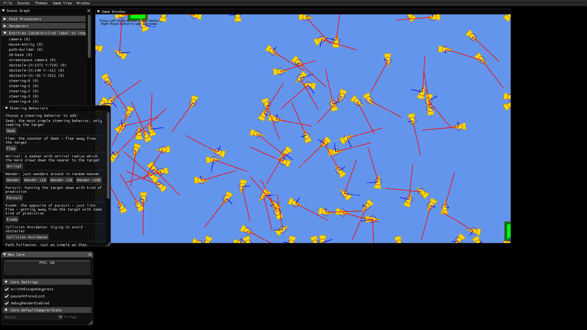
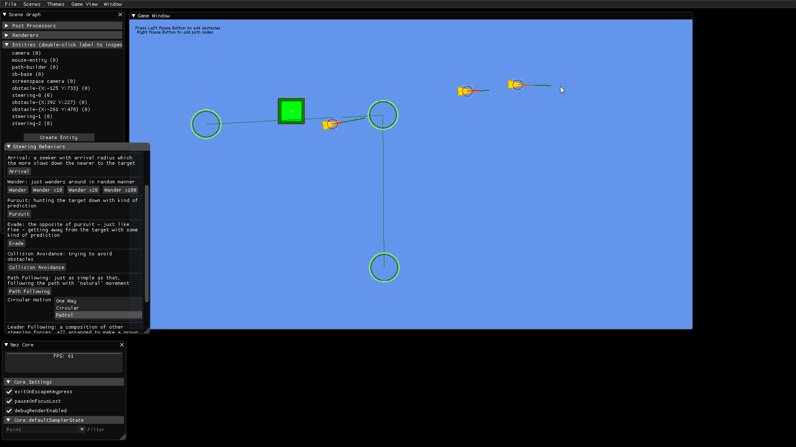

# SteeringBehaviorsNez

A sample project that demonstrates steering behaviors in action. Written in C# using [MonoGame](https://monogame.net) and [Nez](https://github.com/prime31/Nez).

All the behaviors are adapted from the articles written by Fernando Bevilacqua at tutplus.com: **[Understanding Steering Behaviors](https://gamedevelopment.tutsplus.com/series/understanding-steering-behaviors--gamedev-12732)**. Huge thanks to him.

The list of currently implemented behaviors:

 - Seek
 - Flee
 - Arrival
 - Wander
 - Pursuit
 - Evade
 - Collision Avoidance
 - Path Following

To implement:

 - Leader Following
 - Queue

## How to build & run

You'll need to install .NET Core 3.1 SDK or higher. Then clone this repo and don't forget about submodules:

```bash
git clone https://github.com/lunacys/SteeringBehaviorsNez.git --recursive
```

Then go to `SteeringBehaviorsNez` directory and run

```powershell
dotnet run
```

That's it.

## Portability

Although this project currently uses some of awesome Nez features (ImGui debug layout, Entity-Component System, Scenes, etc.), it should be as portable as possible. Currently it is a bit harder than it should be.

## Notes

Please note that this project is heavily under development and there may be some huge API changes. Take code with care.

## Features to implement/architecture stuff

Steering behaviors should be conditional. For example: flee from the mouse cursor only if it is in some kind of range, etc. These conditions should not be hard-coded (which it currently is).

## Screenshots



